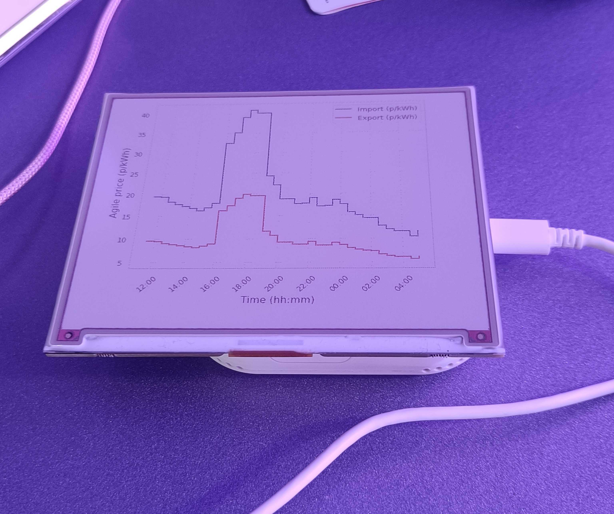

# home-pro-inky-adapter

This allows you to use the display image functionality of the [Pimoroni Inky pHAT](https://shop.pimoroni.com/products/inky-phat) with the Home Pro. Currently it's set up to work with the 5.7" 7 color display. The gpiod libraries used in the Inky pHAT library are not available in the Home Pro SDK, so this project replaces gpiod functions with those of the Octace_GPIO api.

## Running in the home pro sdk
Attach the hat to the 40-pin header on the Home pro. Load the project in the Home Pro SDK. To display an image, run the project with: `python3 image_display.py --file <filename>`. For example, to use the constantine image included here, use `python3 image_display.py --file images/A_Constantine_Dark.png`.

## Show the agile tariff as a line plot
Run `python3 show_agile.py` to show the agile tariff as a line plot on the Inky pHAT. It just shows the previous 6 hours and following 12 hours of import and export tariff price including VAT for a location in England. The data is fetched from the Octopus Energy API. It currently just runs as a once off to show the capability, it doesn't update yet. It needs seaborn to run which can be installed with `pip install seaborn`.

